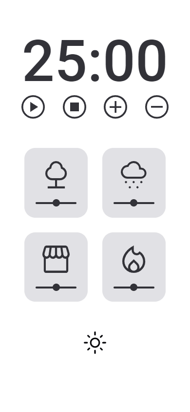
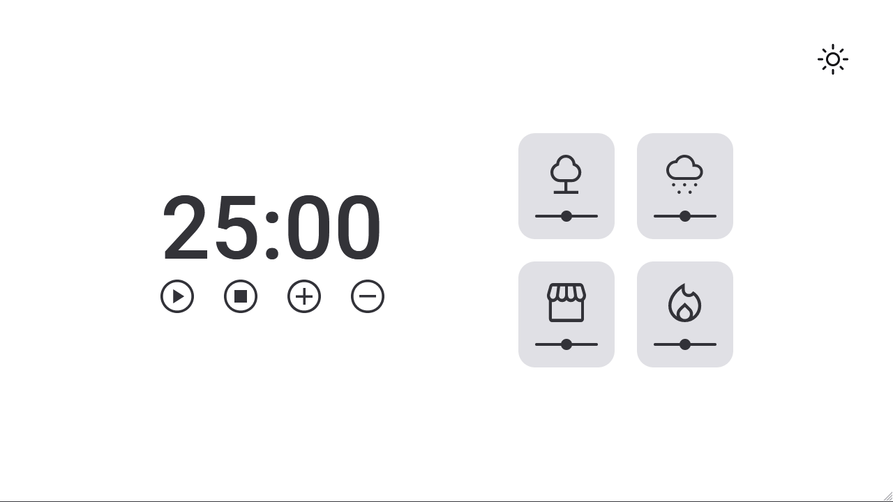

# Focus Timer Dark Mode

Esse projeto é um temporizador no estilo pomodoro com modo escuro e controle de volume dos sons.

## Sumário
- [Pré-Visualização](#pré-visualização)
- [Aviso](#aviso)
- [Sobre](#sobre)
- [Tecnologias](#tecnologias)
- [Funcionalidades](#funcionalidades)
- [Autor](#autor)

 

## Pré-Visualização

<h1 align="center" style="max-width: 412px; margin: auto;">
    
</h1>

<h1 align="center">
    
</h1>

 

## Aviso

- O projeto **está finalizado**, mas talvez tenha melhorias no futuro.

- Esse projeto é uma versão mais avançada do [Focus Timer 2.0](https://github.com/devgustavosantos/focus-timer-2.0) por isso boa parte do projeto foi trazida para cá.

- Para testar o projeto basta [CLICAR AQUI!](https://devgustavosantos.github.io/focus-timer-dark-mode/)

- O layout foi baseado nesse [projeto do figma.](https://www.figma.com/file/nlJJAVuGDc1tnDKqUW4FJA/Stage-05---Dark-Mode-FocusTimer/duplicate)

 

## Sobre

Este é um dos projetos propostos no programa [Explorer da Rocketseat](https://www.rocketseat.com.br/explorer), os [detalhes estão aqui](https://efficient-sloth-d85.notion.site/FocusTimer-Dark-Mode-df7a74c5bcb745a0be5428897eb79b3e), mas basicamente é apresentado um temporizador onde o usuário pode aumentar e diminuir uma contagem regressiva, e ao final desse tempo tocará um alarme.

Além de melhorar exercitar o HTML, CSS e Git, o projeto tem a intenção de trabalhar com alguns conceitos do **clean code**, para melhor entendimento do código, e experimentar a utilização de alguns conteúdos mais avançados do JS:
- Desestruturação;
- Injeção de dependências;
- Modularização;
- Objetos com o padrão factory.

 

## Tecnologias

- **HTML** - usada para fazer a estrutura do conteúdo;
- **CSS** - utilizada para fazer a estilização dos elementos;
- **JS** - usada para fazer a interatividade da página;
- **Git** - utilizada para realizar o versionamento do código.

 

## Funcionalidades

- [x]  Iniciar uma contagem regressiva;
- [x]  Parar o temporizador;
- [x]  Adicionar sons aos cards;
- [x]  Mudar o volume do som
- [x]  O som deverá ser ativado/desativado se o usuário clicar no card;
- [x]  O controle de volume funciona apenas se o card está ativado;
- [x]  Aumentar o temporizador;
- [x]  Diminuir o temporizador;  
- [x]  Adicionar som quando o temporizador for encerrado.
- [x]  Escolher entre o tema claro e o escuro.

 

## Autor

Feito com ❤ por Dev Gustavo Santos 😀 Veja meu [Linkedin.](https://www.linkedin.com/in/devgustavosantos/)

